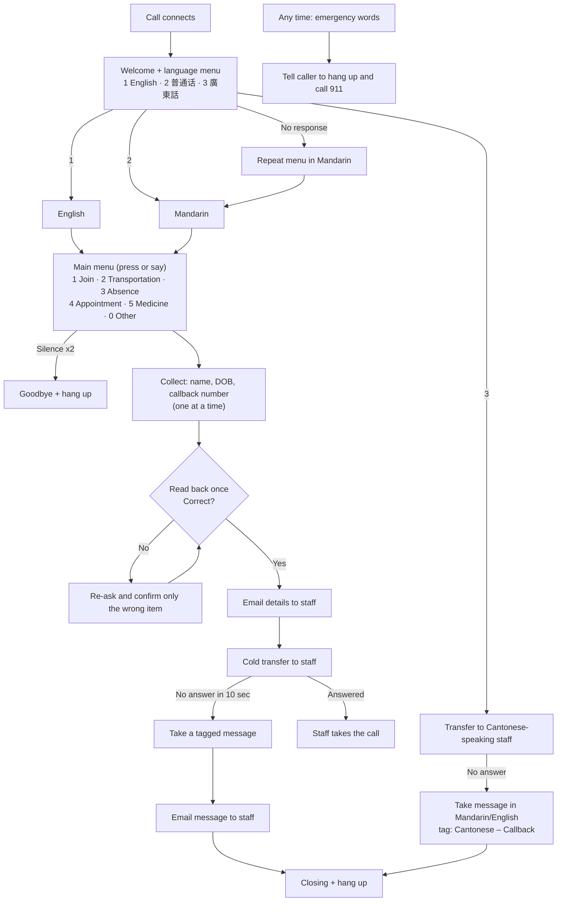

# Call flow

```mermaid
flowchart TD
    A[Call connects] --> B["Welcome + language menu<br/>1 English · 2 普通话 · 3 廣東話"]
    B -->|1| EN[English]
    B -->|2| ZH[Mandarin]
    B -->|3| C[Transfer to Cantonese-speaking staff]
    B -->|No response| B2[Repeat menu in Mandarin] --> ZH

    EN --> M
    ZH --> M
    M["Main menu (press or say)<br/>1 Join · 2 Transportation · 3 Absence<br/>4 Appointment · 5 Medicine · 0 Other"]
    M -->|Silence x2| G[Goodbye + hang up]
    M --> D["Collect: name, DOB, callback number<br/>(one at a time)"]
    D --> R{Read back once<br/>Correct?}
    R -->|No| F[Re-ask and confirm only the wrong item] --> R
    R -->|Yes| S[Email details to staff]
    S --> T[Cold transfer to staff]
    T -->|Answered| Done[Staff takes the call]
    T -->|No answer in 10 sec| MSG[Take a tagged message] --> S2[Email message to staff] --> END[Closing + hang up]

    C -->|No answer| CM[Take message in Mandarin/English<br/>tag: Cantonese – Callback] --> END

    X[Any time: emergency words] --> E[Tell caller to hang up and call 911]
```
